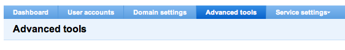
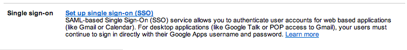
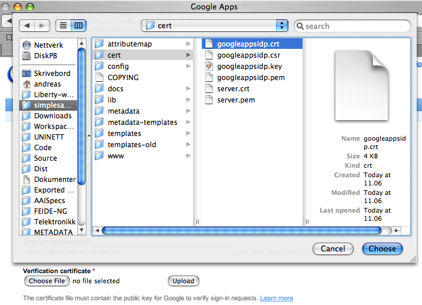
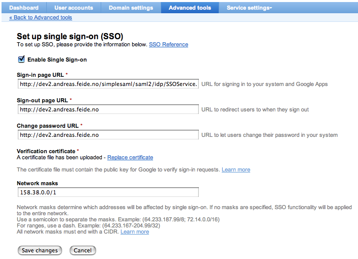

Setting up a SimpleSAMLphp SAML 2.0 IdP to use with Google Workspace (G Suite / Google Apps) for Education
============================================

[TOC]

SimpleSAMLphp news and documentation
------------------------------------

This document is part of the SimpleSAMLphp documentation suite.

 * [List of all SimpleSAMLphp documentation](https://simplesamlphp.org/docs)
 * [SimpleSAMLphp homepage](https://simplesamlphp.org)


## Introduction

This article describes how to configure a Google Workspace (formerly G Suite, formerly Google Apps)
instance as a service provider to use with a SimpleSAMLphp identity provider.
This article assumes that you have already read the SimpleSAMLphp installation manual, and installed
a version of SimpleSAMLphp at your server.

In this example we will setup this server as an IdP for Google Workspace:
	dev2.andreas.feide.no


## Enabling the Identity Provider functionality

Edit `config.php`, and enable the SAML 2.0 IdP:

    'enable.saml20-idp' => true,
    'enable.shib13-idp' => false,

## Setting up a signing certificate

You must generate a certificate for your IdP.
Here is an example of an openssl command to generate a new key and a self signed certificate to use for signing SAML messages:

    openssl req -newkey rsa:3072 -new -x509 -days 3652 -nodes -out googleworkspaceidp.crt -keyout googleworkspaceidp.pem

The certificate above will be valid for 10 years.

Here is an example of typical user input when creating a certificate request:

    Country Name (2 letter code) [AU]:NO
    State or Province Name (full name) [Some-State]:Trondheim
    Locality Name (eg, city) []:Trondheim
    Organization Name (eg, company) [Internet Widgits Pty Ltd]:UNINETT
    Organizational Unit Name (eg, section) []:
    Common Name (eg, YOUR name) []:dev2.andreas.feide.no
    Email Address []:
    
    Please enter the following 'extra' attributes
    to be sent with your certificate request
    A challenge password []:
    An optional company name []:

**Note**: SimpleSAMLphp will only work with RSA and not DSA certificates.


Authentication source
---------------------

The next step is to configure the way users authenticate on your IdP. Various modules in the `modules/` directory provides methods for authenticating your users. This is an overview of those that are included in the SimpleSAMLphp distribution:

`exampleauth:UserPass`
: Authenticate against a list of usernames and passwords.

`exampleauth:Static`
: Automatically log in as a user with a set of attributes.

[`ldap:LDAP`](/docs/contrib_modules/ldap/ldap.html)
: Authenticates an user to a LDAP server.

For more authentication modules, see [SimpleSAMLphp Identity Provider QuickStart](simplesamlphp-idp).


In this guide, we will use the `exampleauth:UserPass` authentication module. This module does not have any dependencies, and is therefore simple to set up.

After you have successfuly tested that everything is working with the simple `exampleauth:UserPass`, you are encouraged to setup SimpleSAMLphp IdP towards your user storage, such as an LDAP directory. (Use the links on the authentication sources above to read more about these setups. `ldap:LDAP` is the most common authentication source.)


Configuring the authentication source
-------------------------------------

The `exampleauth:UserPass` authentication module is part of the `exampleauth` module. This module isn't enabled by default, so you will have to enable it. In
`config.php`, search for the `module.enable` key and set `exampleauth` to true:

```
    'module.enable' => [
         'exampleauth' => true,
         …
    ],
```

The next step is to create an authentication source with this module. An authentication source is an authentication module with a specific configuration. Each authentication source has a name, which is used to refer to this specific configuration in the IdP configuration. Configuration for authentication sources can be found in `config/authsources.php`.

In this example we will use `example-userpass`, and hence that section is what matters and will be used.

	<?php
	$config = [
		'example-userpass' => [
			'exampleauth:UserPass',
			'student:studentpass' => [
				'uid' => ['student'],
			],
			'employee:employeepass' => [
				'uid' => ['employee'],
			],
		],
	];
	?>

This configuration creates two users - `student` and `employee`, with the passwords `studentpass` and `employeepass`. The username and password are stored in the array index `student:studentpass` for the `student`-user. The attributes (only `uid` in this example) will be returned by the IdP when the user logs on.


## Configuring metadata for an SAML 2.0 IdP

If you want to setup a SAML 2.0 IdP for Google Workspace, you need to configure two metadata files: `saml20-idp-hosted.php` and `saml20-sp-remote.php`.


### Configuring SAML 2.0 IdP Hosted metadata

This is the configuration of the IdP itself. Here is some example config:

	// The SAML entity ID is the index of this config. Dynamic:X will automatically generate an entity ID (recommended)
	$metadata['__DYNAMIC:1__'] => [
		
		// The hostname of the server (VHOST) that this SAML entity will use.
		'host'				=>	'__DEFAULT__',
		
		// X.509 key and certificate. Relative to the cert directory.
		'privatekey'   => 'googleworkspaceidp.pem',
		'certificate'  => 'googleappsidp.crt',
		
		'auth' => 'example-userpass',
	]

**Note**: You can only have one entry in the file with host equal to `__DEFAULT__`, therefore you should replace the existing entry with this one, instead of adding this entry as a new entry in the file. 


### Configuring SAML 2.0 SP Remote metadata

In the `saml20-sp-remote.php` file we will configure an entry for Google Workspace for Education. There is already an entry for Google Workspace in the template, but we will change the domain name:

      /*
       * This example shows an example config that works with Google Workspace (G Suite / Google Apps) for education.
       * What is important is that you have an attribute in your IdP that maps to the local part of the email address
       * at Google Workspace. E.g. if your google account is foo.com, and you have a user with email john@foo.com, then you
       * must set the simplesaml.nameidattribute to be the name of an attribute that for this user has the value of 'john'.
       */
      $metadata['https://www.google.com/a/g.feide.no'] => [
        'AssertionConsumerService'   => 'https://www.google.com/a/g.feide.no/acs', 
        'NameIDFormat'               => 'urn:oasis:names:tc:SAML:1.1:nameid-format:emailAddress',
        'simplesaml.nameidattribute' => 'uid',
        'simplesaml.attributes'      => false
      ];

You must also map some attributes received from the authentication module into email field sent to Google Workspace. In this example, the  `uid` attribute is set.  When you later configure the IdP to connect to a LDAP directory or some other authentication source, make sure that the `uid` attribute is set properly, or you can configure another attribute to use here. The `uid` attribute contains the local part of the user name.

For an e-mail address `student@g.feide.no`, the `uid` should be set to `student`.

You should modify the `AssertionConsumerService` to include your G Suite domain name instead of `g.feide.no`.

For an explanation of the parameters, see the
[SimpleSAMLphp Identity Provider QuickStart](simplesamlphp-idp).

## Configure Google Workspace

Start by logging in to our Google Workspace for education account panel.
Then select "Advanced tools":

**Figure&nbsp;1.&nbsp;We go to advanced tools**



Then select "Set up single sign-on (SSO)":

**Figure&nbsp;2.&nbsp;We go to setup SSO**


Upload a certificate, such as the googleworkspaceidp.crt created above:

**Figure&nbsp;3.&nbsp;Uploading certificate**


Fill out the remaining fields:

The most important field is the Sign-in page URL. You can find the
correct value in your IdP metadata. Browse to your simpleSAMLphp installation,
go to the "Federation" tab, under "SAML 2.0 IdP Metadata" select "show metadata".

You will find in the metadata the XML tag `<md:SingleSignOnService>`
which contains the right URL to input in the field, it will look something
like this:

	https://dev2.andreas.feide.no/simplesaml/saml2/idp/SSOService.php

The Sign-out page or change password URL can be static pages on your server.
(Google does not support SAML Single Log Out.)

The network mask determines which IP addresses will be asked for SSO login.
IP addresses not matching this mask will be presented with the normal Google Workspace login page.
It is normally best to leave this field empty to enable authentication for all URLs.

**Figure&nbsp;4.&nbsp;Fill out the remaining fields**



### Add a user in G Suite that is known to the IdP

Before we can test login, a new user must be defined in Google Workspace. This user must have a mail field matching the email prefix mapped from the attribute as described above in the metadata section.

## Test to login to G Suite for education

Go to the URL of your mail account for this domain, the URL is similar to the following:

	http://mail.google.com/a/yourgoogleappsdomain.com

replacing the last part with your own Google Workspace domain name.

## Security Considerations

Make sure that your IdP server runs HTTPS (TLS). The Apache documentation contains information for how to configure HTTPS.

Support
-------

If you need help to make this work, or want to discuss SimpleSAMLphp with other users of the software, you are fortunate: Around SimpleSAMLphp there is a great Open source community, and you are welcome to join! The forums are open for you to ask questions, contribute answers other further questions, request improvements or contribute with code or plugins of your own.

-  [SimpleSAMLphp homepage](https://simplesamlphp.org)
-  [List of all available SimpleSAMLphp documentation](https://simplesamlphp.org/docs/)
-  [Join the SimpleSAMLphp user's mailing list](https://simplesamlphp.org/lists)

