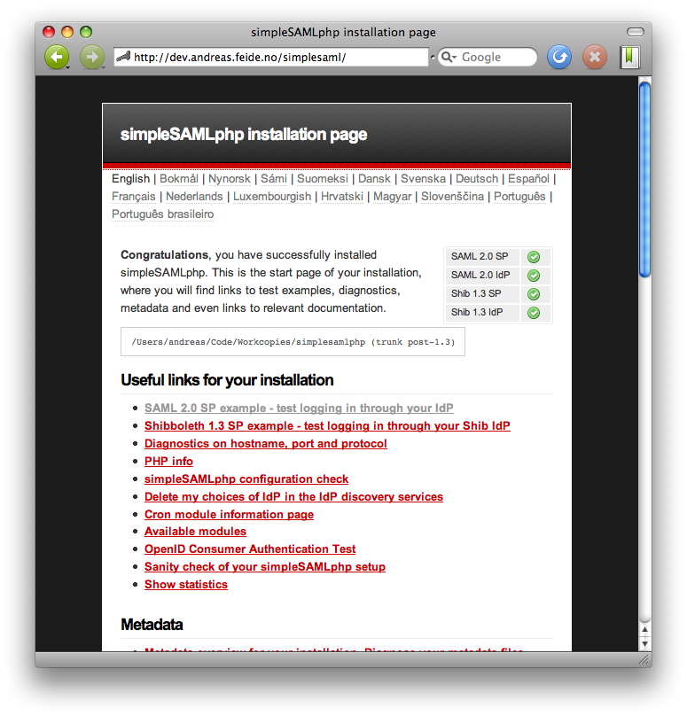

SimpleSAMLphp Installation and Configuration
============================================

[TOC]

This document is part of the SimpleSAMLphp documentation suite.

 * [List of all SimpleSAMLphp documentation](https://simplesamlphp.org/docs)
 * [SimpleSAMLphp homepage](https://simplesamlphp.org)


This document covers the installation of the latest stable version of SimpleSAMLphp.
If you want to install the development version, take a look at the instructions for [installing SimpleSAMLphp from the 
repository](simplesamlphp-install-repo).


Prerequisites
-------------

 * A web server capable of executing PHP scripts.
 * PHP version >= 7.1.0.
 * Support for the following PHP extensions:
   * Always required: `date`, `dom`, `hash`, `libxml`, `openssl`, `pcre`, `SPL`, `zlib`, `json`, `mbstring`
   * When automatically checking for latest versions, and used by some modules: `cURL`
   * When authenticating against an LDAP server: `ldap`
   * When authenticating against a RADIUS server: `radius`
   * When using the native PHP session handler: `session`
   * When saving session information to a memcache server: `memcache`
   * When using databases:
     * Always required: `PDO`
     * Database driver: (`mysql`, `pgsql`, ...)
 * Support for the following PHP packages:
   * When saving session information to a Redis server: `predis`

What actual packages are required for the various extensions varies between different platforms and distributions.


Download and install SimpleSAMLphp
----------------------------------

The most recent release of SimpleSAMLphp can always be found at
[https://simplesamlphp.org/download](https://simplesamlphp.org/download).

Go to the directory where you want to install SimpleSAMLphp and extract the archive file you just downloaded:

```
    cd /var
    tar xzf simplesamlphp-x.y.z.tar.gz
    mv simplesamlphp-x.y.z simplesamlphp
```

## Upgrading from a previous version of SimpleSAMLphp

Before starting the upgrade, review the relevant
[upgrade notes](simplesamlphp-upgrade-notes) for any relevant
changes.

Extract the new version:

```
    cd /var
    tar xzf simplesamlphp-x.y.z.tar.gz
```

Copy the configuration files from the previous version (in case the configuration directory is inside SimpleSAMLphp,
keep reading for other alternatives):

```
    cd /var/simplesamlphp-x.y.z
    rm -rf config metadata
    cp -rv ../simplesamlphp/config config
    cp -rv ../simplesamlphp/metadata metadata
```

If you have installed any [third-party modules](https://simplesamlphp.org/modules) or [customised the theme](simplesamlphp-theming.md), 
you should check whether your third-party modules need upgrading and then copy or replace those directories too.

Replace the old version with the new version:

```
    cd /var
    mv simplesamlphp simplesamlphp.old
    mv simplesamlphp-x.y.z simplesamlphp
```

If the format of the config files or metadata has changed from your previous version of SimpleSAMLphp (check the
upgrade notes), you may have to update your configuration and metadata after updating the SimpleSAMLphp code.


### Upgrading configuration files

A good approach is to run a `diff` between your previous `config.php` file and the new `config.php` file located in
`config-templates/config.php`, and apply relevant modifications to the new template. This will ensure that all new 
entries in the latest version of config.php are included, as well as preserve your local modifications.


### Upgrading metadata files

Most likely the metadata format is backwards compatible. If not, you should receive a very clear error message at
startup indicating how and what you need to update. You should look through the metadata in the `metadata-templates`
directory after the upgrade to see whether recommended defaults have been changed.


Configuration
-------------

### Location of configuration files

By default, SimpleSAMLphp looks for its configuration in the `config` directory in the root of its own directory. This
has some drawbacks, like making it harder to update SimpleSAMLphp or to install it as a composer dependency, or to 
package it for different operating systems.

In order to avoid this limitations, it is possible to specify an alternative location for the configuration directory
by setting the `SIMPLESAMLPHP_CONFIG_DIR` environment variable to point to this location. This way, the configuration 
directory doesn't need to be inside the library's directory, making it easier to manage and to update. The simplest way
to set this environment variable is to set it in your web server's configuration. See the next section for more
information.


Configuring Apache
------------------

Examples below assume that SimpleSAMLphp is installed in the default location, `/var/simplesamlphp`. You may choose
another location, but this requires a path update in a few files. See Appendix _Installing SimpleSAMLphp 
in alternative locations_ for more details.

The only subdirectory of `SimpleSAMLphp` that needs to be accessible from the web is `www`. There are several ways of
exposing SimpleSAMLphp depending on the way web sites are structured on your Apache web server. The following is just
one possible configuration.

Find the Apache configuration file for the virtual hosts where you want to run SimpleSAMLphp. The configuration may
look like this:

```
    <VirtualHost *>
            ServerName service.example.com
            DocumentRoot /var/www/service.example.com

            SetEnv SIMPLESAMLPHP_CONFIG_DIR /var/simplesamlphp/config

            Alias /simplesaml /var/simplesamlphp/www

            <Directory /var/simplesamlphp/www>
                Require all granted
            </Directory>
    </VirtualHost>
```

Note the `Alias` directive, which gives control to SimpleSAMLphp for all urls matching
`http(s)://service.example.com/simplesaml/*`. SimpleSAMLphp makes several SAML interfaces available on the web; all of
them are accessible through the `www` subdirectory of your SimpleSAMLphp installation. You can name the alias 
whatever you want, but the name must be specified in the `baseurlpath` configuration option in the `config.php` file of 
SimpleSAMLphp as described in
[the section called “SimpleSAMLphp configuration: config.php”](#section_6 "SimpleSAMLphp configuration: config.php").
Here is an example of how this configuration may look like in `config.php`:

```
$config = [
    [...]
    'baseurlpath' => 'simplesaml/',
    [...]
]
```
    

Note also the `SetEnv` directive in the Apache configuration. It sets the `SIMPLESAMLPHP_CONFIG_DIR` environment 
variable, in this case, to the default location for the configuration directory. You can omit this environment
variable, and SimpleSAMLphp will then look for the `config` directory inside its own directory. If you need to move
your configuration to a different location, you can use this environment variable to tell SimpleSAMLphp where to look
for configuration files. This works only for the `config` directory. If you need your metadata to be in a different
directory too, use the `metadatadir` configuration option to specify the location.

This is just the basic configuration to get things working. For a checklist
further completing your documentation, please see
[Maintenance and configuration: Apache](simplesamlphp-maintenance#section_5).


Configuring Nginx
------------------

Examples below assume that SimpleSAMLphp is installed in the default location, `/var/simplesamlphp`. You may choose
another location, but this requires a path update in a few files. See Appendix _Installing SimpleSAMLphp 
in alternative locations_ for more details.

The only subdirectory of `SimpleSAMLphp` that needs to be accessible from the web is `www`. There are several ways of
exposing SimpleSAMLphp depending on the way web sites are structured on your Nginx web server. The following is just
one possible configuration.

Find the Nginx configuration file for the virtual hosts where you want to run SimpleSAMLphp. The configuration may
look like this:

```
    server {
        listen 443 ssl;
        server_name idp.example.com;

        ssl_certificate        /etc/pki/tls/certs/idp.example.com.crt;
        ssl_certificate_key    /etc/pki/tls/private/idp.example.com.key;
        ssl_protocols          TLSv1.3 TLSv1.2;
        ssl_ciphers            EECDH+AESGCM:EDH+AESGCM;

        location ^~ /simplesaml {
            alias /var/simplesamlphp/www;

            location ~ ^(?<prefix>/simplesaml)(?<phpfile>.+?\.php)(?<pathinfo>/.*)?$ {
                include          fastcgi_params;
                fastcgi_pass     $fastcgi_pass;
                fastcgi_param SCRIPT_FILENAME $document_root$phpfile;

                # Must be prepended with the baseurlpath
                fastcgi_param SCRIPT_NAME /simplesaml$phpfile;

                fastcgi_param PATH_INFO $pathinfo if_not_empty;
            }
        }
    }
```

SimpleSAMLphp configuration: config.php
---------------------------------------

There are a few steps that you should complete in the main configuration file, `config.php`, right away:

-  Set the `baseurlpath` configuration option. Make it point to the canonical URL of your deployment, where
   SimpleSAMLphp can be reached:
   
   ```
       'baseurlpath' => 'https://your.canonical.host.name/simplesaml/',
   ```

   Please note that your canonical URL should always use HTTPS in order to protect your users. Additionally, if you
   are running behind a **reverse proxy** and you are offloading TLS to it, the proper way to tell SimpleSAMLphp that
   its base URL should use HTTPS is to set the `baseurlpath` configuration option properly. SimpleSAMLphp deliberately
   **ignores** the `X-Forwarded-*` set of headers that your proxy might be setting, so **do not rely on those**. 

-  Set an administrator password. This is needed to access some of the pages in your SimpleSAMLphp installation web
   interface.
   
   Hashed passwords can also be used here. See the [`authcrypt`](./authcrypt:authcrypt) documentation
   for more information.

   ```
       'auth.adminpassword' => 'setnewpasswordhere',
   ```

-  Set a secret salt. This should be a random string. Some parts of the SimpleSAMLphp needs this salt to generate
   cryptographically secure hashes. SimpleSAMLphp will give an error if the salt is not changed from the default value.
   The command below can help you to generated a random string on (some) unix systems:

   ```
   tr -c -d '0123456789abcdefghijklmnopqrstuvwxyz' </dev/urandom | dd bs=32 count=1 2>/dev/null;echo
   ```

   Here is an example of the configuration option:

   ```
       'secretsalt' => 'randombytesinsertedhere',
   ```

   **Please note that changing the secret salt may break access to services for your users**. 

-  Configure your data storage. You can do this by editing the `store.type` configuration option, and setting it to
   one of the supported values. Now configure the backend of your choice with the relevant options, if needed.
   
-  Configure your sessions. You have to configure your sessions with the appropriate parameters so that the cookies
   used by SimpleSAMLphp to track users are always delivered to the software. You may do this by editing the
   `session.*` configuration options. Note that if you are using the `phpsession` data storage, the cookie-related
   configuration options are configured in the `session.phpsession.*` options.

-  Set technical contact information. This information will be available in the generated metadata. The e-mail address
   will also be used for receiving error reports sent automatically by SimpleSAMLphp. Here is an example:

   ```
       'technicalcontact_name' => 'John Smith',
       'technicalcontact_email' => 'john.smith@example.com',
   ```

-  If you use SimpleSAMLphp in a country where English is not widespread, you may want to change the default language
   from English to something else:

   ```
       'language.default' => 'no',
   ```

-  Set your timezone

   ```
       'timezone' => 'Europe/Oslo',
   ```

   You can see [a list of Supported Timezones at php.net](http://php.net/manual/en/timezones.php).


Configuring PHP
---------------

### Sending e-mails from PHP

Some parts of SimpleSAMLphp will allow you to send e-mails. For example, sending error reports to the technical admin. If
you want to make use of this functionality, you should make sure your PHP installation is configured to be able to
send e-mails.

By default SimpleSAMLphp uses the PHP `mail()` function, which you can configure via `php.ini`.
For more advanced configuration, including using a remote SMTP server, see the `mail.*` options in `config.php`.

Enabling and disabling modules
------------------------------

If you want to enable some of the modules that are installed with SimpleSAMLphp, but are disabled by default, you 
can do that in the configuration:

```
    'module.enable' => [
         'exampleauth' => true, // Setting to TRUE enables.
         'saml' => false, // Setting to FALSE disables.
         'core' => null, // Unset or NULL uses default for this module.
    ],
```

Set to `true` the modules you want to enable, and to `false` those that you want to disable.

Alternatively, you can enable or disable modules by setting empty files with given names in the module's root 
directory. For example, in order to enable the _consent_ module: 

```
    cd modules/consent
    touch enable
```

If you later want to disable the module, you can rename the `enable` file to `disable`.

```
    cd modules/consent
    mv enable disable
```

This is the traditional way of enabling and disabling modules, but it is **deprecated**. Please do not rely on this in
new installations of the software.


The SimpleSAMLphp installation web page
---------------------------------------

After installing SimpleSAMLphp, you can access the homepage of your installation, which contains some information and
a few links to the test services. The URL of an installation can be e.g.:

    https://service.example.org/simplesaml/

The exact URL depends on how you set it up with your web server, and of course on your hostname.

**Warning**: before you can actually use SimpleSAMLphp for something useful, you need to configure it either as a 
Service Provider or as an Identity Provider, depending on your use case.

Here is an example screenshot of what the SimpleSAMLphp page looks like:



### Check your PHP environment

At the bottom of the installation page there are some green lights. SimpleSAMLphp runs some tests to see whether the 
required and recommended prerequisites are met. If any of the lights are red, you may have to install some PHP 
extensions or external PHP packages (e.g. you need the PHP LDAP extension to use the LDAP authentication module).

## Building assets

Run the following commands to build the default theme.

```
npm install
npm run build
```

## Next steps

You have now successfully installed SimpleSAMLphp, and the next steps depend on whether you want to setup a Service
Provider (in order to protect access to an existing application) or an Identity Provider (which you would connect to 
a user database where your users can authenticate). Documentation on bridging between federation protocols is found 
in a separate document.

 - [Using SimpleSAMLphp as a Service Provider (SP)](simplesamlphp-sp)
   + [Remote IdP reference](simplesamlphp-reference-idp-remote)
   + [Connecting to the UK Access Federation or InCommon](simplesamlphp-ukaccess)
 - [Using SimpleSAMLphp as an Identity Provider (IdP)](simplesamlphp-idp)
   + [Hosted IdP reference](simplesamlphp-reference-idp-hosted)
   + [Remote SP reference](simplesamlphp-reference-sp-remote)
   + [Setting up an IdP for Google Workspace (G Suite / Google Apps)](simplesamlphp-googleapps)
   + [Advanced Topics](simplesamlphp-idp-more)
 - [Automated Metadata Management](/docs/contrib_modules/metarefresh/simplesamlphp-automated_metadata)
 - [Maintenance and configuration](simplesamlphp-maintenance)


Support
-------

If you need help to make this work, or want to discuss SimpleSAMLphp with other users of the software, you are
in luck: there is a great Open Source community around SimpleSAMLphp, and you are welcome to join! The forums are open 
for you to ask questions, help others by answering their questions, request improvements or contribute with 
code or plugins of your own.

-  [Homepage](https://simplesamlphp.org)
-  [Documentation](https://simplesamlphp.org/docs/)
-  [Mailing lists](https://simplesamlphp.org/lists)


Appendix: Installing SimpleSAMLphp in alternative locations
-------------------------------------------------

There may be several reasons why you want to install SimpleSAMLphp in an alternative way.

- You are installing SimpleSAMLphp in a hosted environment where you do not have root access, and cannot change
   Apache configuration. You can still install SimpleSAMLphp, keep on reading!

- You have full permissions to the server, but cannot edit web server configuration for some reason like internal 
policies.

The SimpleSAMLphp package contains one folder named `simplesamlphp-x.y.z` (where `x.y.z` is the version number). In 
this folder there are a lot of subfolders for library, metadata, configuration, etc. One of these folders is named 
`www`. **Only this folder should be exposed on the web**. The recommended configuration is to put the whole 
`simplesamlphp` folder outside the web root, and then link to the `www` folder by using the `Alias` directive, as 
described in [the section called “Configuring Apache”](#section_4 "Configuring Apache"). This is not the only
possible way, though.

As an example, let's see how you can install SimpleSAMLphp in your home directory on a shared hosting server.

1. Extract the SimpleSAMLphp archive in your home directory:

   ```
   cd ~
   tar xzf simplesamlphp-1.x.y.tar.gz
   mv simplesamlphp-1.x.y simplesamlphp
   ```

2. Then you can try to make a symlink into the `public_html` directory.

   ```
   cd ~/public_html
   ln -s ../simplesamlphp/www simplesaml
   ```

3. Next, you need to set the `baseurlpath` configuration option with the URL pointing to the `simplesaml` link you 
just created in your `public_html` directory. For example, if your home directory is reachable in
`https://host.example/~myaccount/`, set the base URL path accordingly:

   ```
       'baseurlpath' => 'https://host.example/~myaccount/simplesaml/', 
   ```

   Now, you can go to the URL of your installation and check if things work:

       https://host.example/~myaccount/simplesaml/


#### Tip

Symlinking may fail, because some Apache configurations do not allow you to link to files from outside the 
`public_html` folder. If so, you can move the `www` folder instead of symlinking it:

```
    cd ~/public_html
    mv ../simplesamlphp/www simplesaml
```

Now you have the following directory structure.

- `~/simplesamlphp`

- `~/public_html/simplesaml` where `simplesaml` is the `www` directory from the `simplesamlphp` installation directory,
  either moved or a symlink.

Now, we need to make a few configuration changes. First, let's edit `~/public_html/simplesaml/_include.php`:

Change the two lines from:

```
    require_once(dirname(dirname(__FILE__)) . '/lib/_autoload.php');
```

to something like:

```
    require_once(dirname(dirname(dirname(__FILE__))) . '/lib/_autoload.php');
```

**Warning**: note that this will make upgrading SimpleSAMLphp much more difficult, since you will need to move the 
`www` directory and manually edit files every time you upgrade. It is also possible that this method does not work in
future versions of SimpleSAMLphp, and therefore it is discouraged and should be used only as a last resort.
